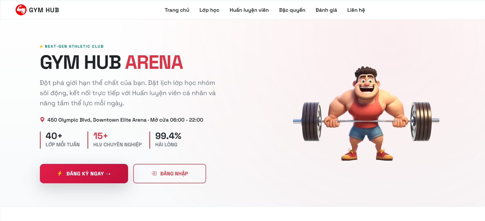
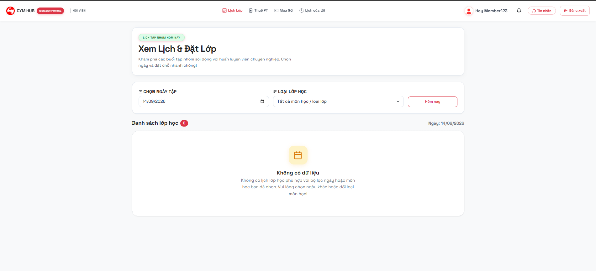
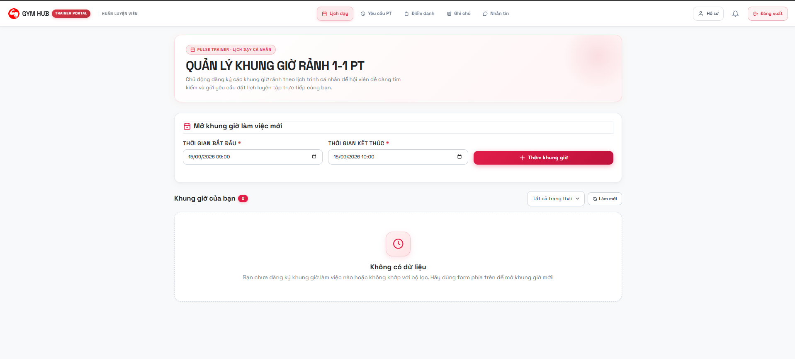
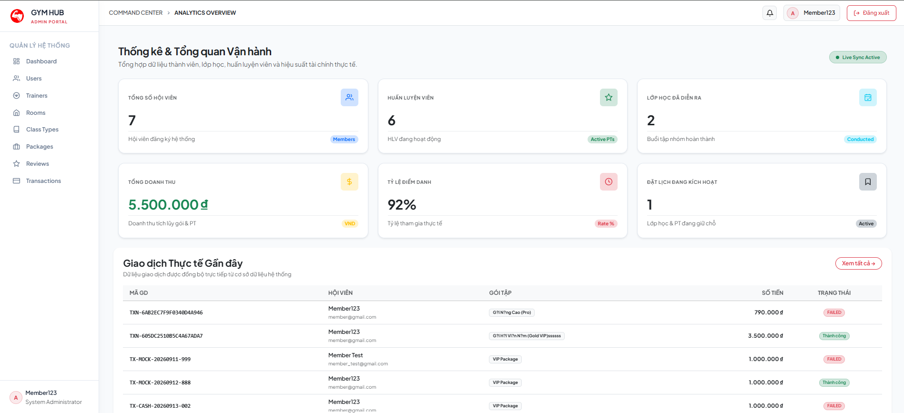
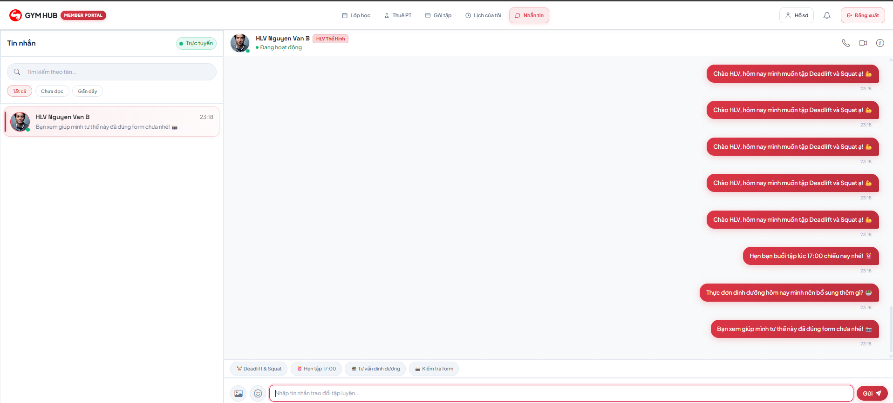

# 🏋️‍♂️ Gym Class Booking & Trainer Chat System

> A web application for gym class booking, 1-on-1 personal training sessions, and real-time communication between members and trainers.

[](#)
[](#)
[](#)
[](#)

---

## 📖 Overview

**Gym Class Booking & Trainer Chat System** is a web application designed to help gyms manage their core operations, including group class scheduling and booking, 1-on-1 personal training (PT) sessions, membership packages and simulated transactions, attendance tracking, reviews, and real-time communication between members and trainers throughout their training sessions.

The system follows a Layered Architecture organized by business domains, with a focus on maintainability, scalability, and practical use in small- to medium-sized gym environments.

## ✨ Key Features

### 👤 Guest

- View gym information and available class types.
- View trainer profiles and professional information.
- Register a new Member account.
- Account validation and duplicate email checking.

### 🧑 Member

- **Authentication & Profile:** Log in, reset/change password, and manage personal profile information.
- **Membership Packages:** Browse available packages, purchase packages through simulated payments, and view active membership information.
- **Class Schedule:** Browse available gym classes and view personal schedules.
- **Group Class Booking:** Book available group classes and manage personal class bookings.
- **PT Booking:** Request 1-on-1 personal training sessions based on trainer availability.
- **Booking Management:** View and manage personal bookings, including supported cancellation operations.
- **Real-time Chat:** Communicate with assigned trainers through real-time messaging.
- **Reviews & Ratings:** Submit reviews and ratings for completed training sessions.
- **Notifications:** Receive and view system notifications related to bookings and other activities.

### 🏋️ Trainer

- **Profile Management:** Manage trainer profile and professional information.
- **Availability Management:** Create and manage available training time slots.
- **Group Class Management:** Manage assigned gym classes and their schedules.
- **PT Booking Management:** Review and accept or reject personal training requests.
- **Attendance Tracking:** Record member attendance for group classes and PT sessions.
- **Real-time Communication:** Communicate with members through the chat system.
- **Progress Tracking:** Create and manage private progress notes for assigned members.

### 🛠️ Admin

- **User Management:** Manage Member and Trainer accounts and account status.
- **Class Management:** Manage gym classes, class types, and schedules.
- **Room Management:** Manage training rooms and room information.
- **Membership Management:** Manage membership packages and member package information.
- **Transaction Management:** View and manage simulated payment transactions.
- **Review Moderation:** Manage and moderate member reviews.
- **Reports & Analytics:** View system statistics and operational analytics through the Admin dashboard.

## 🏗️ System Architecture

The system follows a **Layered Architecture**:

```
Presentation Layer  →  Controller Layer  →  Service Layer  →  Repository Layer  →  Database Layer
```

- **Controller**: Handles HTTP requests, validates input data, and delegates requests to the Service layer.
- **Service**: Implements core business logic such as booking, simulated payments, chat, notifications, and other business operations.
- **Repository**: Handles data access using Spring Data JPA.
- **DTO**: Transfers data between layers and helps prevent direct exposure of Entity objects.

The source code follows a **domain-driven package breakdown**, with each module organized into: `controller → service → repository → entity`

Main module:
`auth` · `user` · `trainer` · `room` · `class` · `booking` · `membership` · `payment` · `attendance` · `review` · `progress` · `chat` · `notification` · `admin`

### 💬 Real-time Chat Architecture

The system uses **Spring WebSocket + STOMP** to enable real-time messaging between Members and Trainers, along with a notification mechanism to notify users when new messages are received.

## 📸 Screenshots

### Landing Page



### Member



### Trainer



### Admin Dashboard



### Real-time Chat



## 🎨 UI/UX Design

- [Figma Design](https://www.figma.com/design/l3bnjnSnigQO5LNHhPFgzY/Gym-Class-Booking---Trainer-Chat-System?node-id=2-1118&t=K3K3vGYPoEu0EWc7-1)

## 📐 UML & System Diagrams

- [Draw.io Link](https://drive.google.com/file/d/1z8dWa-pZpoLJ2EKvIMjTzN-pH0muALov/view?usp=sharing)

## 🗄️ Database Design

The database consists of 15 main entities:

`User` · `TrainerProfile` · `Room` · `ClassType` · `GymClass` · `TrainerTimeSlot` · `ClassBooking` · `PTBooking` · `Package` · `MemberPackage` · `Transaction` · `Review` · `ChatMessage` · `ProgressNote` · `Notification`

Detailed ERD, Data Dictionary, Use Case Specifications, Sequence Diagrams, Activity Diagrams, State Diagrams, and Class Diagrams are provided in the design documentation under (`/docs`).

### Business Status Flows

| Entity             | Status Flow                                                                  |
| ------------------ | ---------------------------------------------------------------------------- |
| Booking (Class/PT) | `Pending` → `Confirmed` → `Completed` / `Rejected` / `Cancelled` / `No-show` |
| GymClass           | `Scheduled` → `Full` → `Completed` / `Cancelled`                             |
| User Account       | `Pending` → `Active` → `Locked` / `Rejected`                                 |

## 🧰 Technology Stack

| Component          | Technology                                 |
| ------------------ | ------------------------------------------ |
| Backend            | Java + Spring Boot                         |
| Real-time chat     | Spring WebSocket + STOMP                   |
| Database           | PostgreSQL                                 |
| Frontend           | TypeScript, HTML/CSS/Bootstrap             |
| Build tool (FE)    | Vite (Vanilla TypeScript)                  |
| Frontend Libraries | `@stomp/stompjs`, `sockjs-client`, `axios` |
| Build & VCS        | Maven/Gradle, Git                          |
| Deployment         | Docker                                     |

## 🚀 Getting Started

### Prerequisites

- **Java JDK 17+**
- **Node.js 20+**
- **npm**
- **Git**
- **Docker & Docker Compose** (recommended for PostgreSQL)

### Installation

#### 1. Clone the repository

```bash
git clone https://github.com/Minhhieu3012/gym-class-booking-system.git
```

#### 2. Start PostgreSQL

The project provides a Docker Compose configuration for the PostgreSQL database.

```bash
docker compose up -d
```

Check the running containers:

```bash
docker compose ps
```

#### 3. Configure the backend

Open:

```text
src/main/resources/application.yaml
```

Configure the PostgreSQL connection according to your local environment.

Example:

```yaml
spring:
  datasource:
    url: jdbc:postgresql://localhost:5432/gym_booking_db
    username: postgres
    password: your_password
```

#### 4. Run the backend

From the project root directory:

**Windows:**

```bash
.\mvnw.cmd spring-boot:run
```

**Linux / macOS:**

```bash
./mvnw spring-boot:run
```

The backend API will be available at:

```text
http://localhost:8080
```

#### 5. Install frontend dependencies

Open a new terminal:

```bash
cd frontend-app
npm install
```

#### 6. Run the frontend

```bash
npm run dev
```

The Vite development server will start at the URL displayed in the terminal, typically:

```text
http://localhost:5173
```

#### API Testing

The project includes a Postman collection:

```text
postman_collection.json
```

Import this file into **Postman** to test the available REST API endpoints.

## 📄 License

This project is developed for educational.
